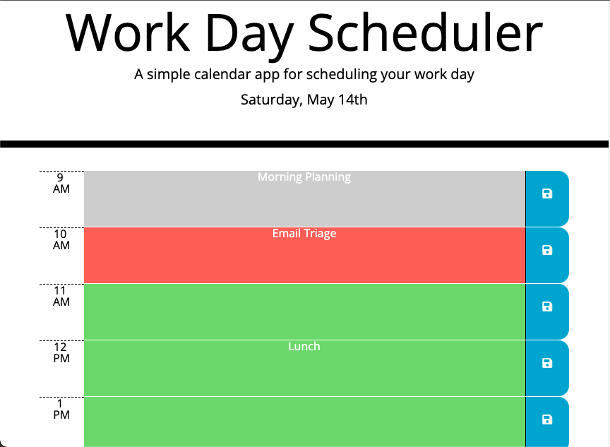

# Work Day Scheduler 

Work Day Scheduler is a lightweight and simple single page application for planning your day.

## Features
- **Dynamic Color Coding** changes the color of each hour depending on if it's past, present or future.
- **Pesistant Data Storage** will keep your tasks for the day stored even if you close the window or refresh the page. 
- **Clean Slate Design** means that every day you start with a clean and open schedule. We do this by removing any items from the previous day automatically on page load. 

### Tech Used
Work Day Scheduler was built using jQuery, Bootstrap, Moment JS and JavaScript.

